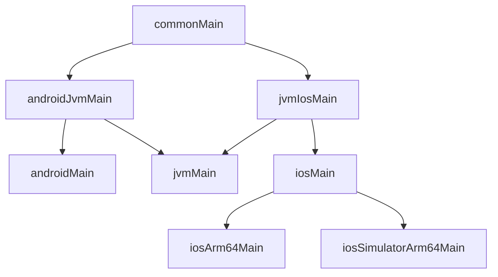

# Han1meViewer+ CMP 技术文档

本文面向维护者和贡献者，按当前 CMP 工程说明架构、源集边界和开发入口。用户介绍见 [README](README.md)，签名、打包和上传顺序见 [正式版构建行动指南](正式版构建行动指南.md)。

## 1. 技术与构建基线

工程使用 Kotlin Multiplatform 共享业务和平台抽象，使用 Compose Multiplatform 共享主要界面。Android、桌面 JVM 和 iOS 各自提供应用入口与系统实现。

下表是仓库当前锁定值，升级时以 [版本目录](gradle/libs.versions.toml) 和各模块构建脚本为准。

| 范围 | 当前配置 |
| --- | --- |
| Kotlin / Compose Compiler | 2.4.10 |
| Compose Multiplatform | 1.12.0；共享 Material 3 为 1.11.0-alpha07 |
| Android Gradle Plugin / Gradle Wrapper | 9.3.1 / 9.6.1 |
| Gradle Daemon JDK | 25；桌面打包要求该 JDK 包含 `jmods/` |
| JVM 编译目标 | `:app` 与 `:shared` 的 Android/JVM 目标为 21；`:desktopApp` 使用 JDK 25 toolchain |
| Android SDK | `minSdk=29`，`compileSdk=37`，`targetSdk=37` |
| iOS | Deployment Target 15.0；`iosArm64`、`iosSimulatorArm64` |
| 导航 / 页面状态 | Navigation 3、ViewModel、StateFlow / SharedFlow |
| 依赖注入 | Koin 4.2.2；Annotations / KSP Compiler 同为 2.3.1 |
| 网络 / HTML | Ktor 3.5.2、Ktorfit 2.7.5、Ksoup 0.2.6、kotlinx.serialization |
| 存储 | Room 3.0.1、Bundled SQLite、Preferences DataStore 1.2.1 |
| 图片 / 文件 / 日志 | Coil 3、FileKit、Kermit |
| 桌面窗口与分发 | Nucleus 2.5.15，TAO 后端 |
| 桌面与 iOS 播放适配 | `io.github.darriousliu.mediamp`，统一版本 `0.4.0-tao` |

Android Compose 依赖另外使用 AndroidX BOM 和 Material 3；共享源码使用 JetBrains 的 CMP 制品。不要只按 `androidx.*` 的 import 判断依赖能否放进 `commonMain`。

## 2. 模块与源集

[settings.gradle.kts](settings.gradle.kts) 只包含三个 Gradle 模块。`iosApp` 是独立 Xcode 工程。

| 位置 | 职责 |
| --- | --- |
| `shared/` | 共享 UI、ViewModel、网络、数据库、设置、资源，以及各平台的 actual 实现 |
| `app/` | Android application 壳、Manifest、启动图标、CMake/JNI、APK 打包与 R8 |
| `desktopApp/` | 桌面入口、TAO 窗口、libmpv 资源解包、运行时与安装包配置 |
| `iosApp/` | SwiftUI / UIKit 壳、Info.plist、签名和版本配置、Xcode scheme |
| `buildSrc/` | `Config.App` 的统一版本与应用标识、构建辅助代码 |

Android 的主要业务代码和 Activity 已在 `shared/src/androidMain`，共享页面在 `shared/src/commonMain`；查找新功能时从 `shared` 开始。

```text
shared/src/
├── commonMain/
│   ├── kotlin/               共享界面、业务、状态与 expect 声明
│   └── composeResources/     字符串、图片、许可清单、关键 H 帧
├── androidJvmMain/kotlin/    Android + JVM：OkHttp、DNS、代理与限速
├── jvmIosMain/kotlin/        JVM + iOS：MediaMP 控制、文件与下载存储共用逻辑
├── androidMain/             Android 平台实现与 Android 资源
├── jvmMain/kotlin/          桌面平台实现
└── iosMain/kotlin/          iOS 平台实现，由两个 iOS target 共用
```

源集依赖关系：



箭头指向依赖上游代码的源集。`jvmMain` 同时依赖两个中间源集：网络能力与 Android 共用，MediaMP 控制能力与 iOS 共用。

`expect/actual` 按功能域放在 `logic/platform`、`logic/network`、`ui/player`、`util` 等包中。只有因同一职责而共享的实现才放中间源集；两个平台恰好都返回空值，不足以成为合并理由。历史整理记录见 [expect/actual 归类清单](expect-actual%20归类清单.md)。

## 3. 应用入口与初始化

| 平台 | 入口与调用链 |
| --- | --- |
| Android | [HanimeApplication.kt](shared/src/androidMain/kotlin/io/github/darriousliu/han1meviewer/HanimeApplication.kt) 初始化存储、平台网络与 Koin；[MainActivity.kt](shared/src/androidMain/kotlin/io/github/darriousliu/han1meviewer/ui/activity/MainActivity.kt) 承载界面 |
| 桌面 | [main.kt](desktopApp/src/main/kotlin/io/github/darriousliu/han1meviewer/main.kt) 初始化 FileKit、`initAppOnce()` 和 mpv 预热，再进入 `nucleusApplication(backend = NucleusBackend.Tao)` |
| iOS | `iosApp/iosApp/ContentView.swift` 调用 [MainViewController.kt](shared/src/iosMain/kotlin/io/github/darriousliu/han1meviewer/MainViewController.kt)，通过 `ComposeUIViewController` 承载 `App()` |

共享启动逻辑在 [Initialization.kt](shared/src/commonMain/kotlin/io/github/darriousliu/han1meviewer/di/Initialization.kt)：先初始化 `DataStoreManager` 并安装 `SettingsRepository`，再应用语言和平台网络，最后启动 Koin。部分依赖创建时就会读取设置，这个顺序需要保留。

`AppModule` 使用 `@ComponentScan` 扫描应用包；新增 `@KoinViewModel`、`@Single`、`@Factory` 后由 KSP 生成定义。平台初始化不要放入会反复重组的 Composable。

## 4. 页面、状态与导航

以下未加源集前缀的 Kotlin 路径，均相对于 `shared/src/commonMain/kotlin/io/github/darriousliu/han1meviewer/`。

### 分层和数据流

```text
Compose 页面 -> ViewModel -> NetworkRepo -> HanimeNetwork -> Ktorfit / Ktor
                                                   响应 -> Parser / GetchuParser -> 状态 Flow -> UI

ViewModel / 下载控制器 -> DatabaseRepo / Room DAO -> 数据库 Flow -> UI
设置页 -> SettingsRepository -> DataStoreManager -> AppSettings -> UI / 平台实现
```

- 页面负责显示状态和派发用户动作，业务状态由 ViewModel 管理。
- `NetworkRepo` 统一封装网络操作与异常；`Parser` / `GetchuParser` 将 HTML 转成业务模型。
- 持久页面状态使用 StateFlow，一次性事件使用 SharedFlow 或 UI 回调。
- 数据库、网络请求、分页合并和登录态判断不直接散落在 Composable 中。

当前状态模型都位于 `logic/state/`：

| 类型 | 用途 |
| --- | --- |
| `WebsiteState<T>` | 普通加载、成功与失败结果 |
| `PageLoadingState<T>` | 网络分页结果，含 `NoMoreData` |
| `PageState<T>` | 页面展示状态，含刷新、追加加载、空列表和失败时的缓存数据 |
| `VideoLoadingState<T>` | 视频加载、成功、失败与无内容 |
| `DownloadState` | 下载排队、运行、暂停、完成与失败等状态 |

### Navigation 3

`ui/navigation/main/HanimeScreen.kt` 定义实现 `NavKey` 的可序列化路由。`TopNavigation.kt` 使用 `NavDisplay`、`entryProvider`、页面状态和 ViewModel 的 entry decorators；`TopLevelBackStack.kt` 管理返回栈。

`SearchRoute(query, advancedSearchJson)` 支持普通搜索和高级搜索；`VideoRoute(videoCode, localUri)` 承载在线与本地视频入口。登录、手动 Cookie、Cloudflare 和头像裁剪也都是共享路由。设置路由定义在 `ui/navigation/settings/SettingsRoutes.kt`，由主导航注册对应页面。

路由只传必要标识和参数，不传整份页面模型。跨平台深链接先经 `DeepLinkTarget.kt` 解析，再由 `DeepLinkBus` 分发；系统 URI、文件和命令行入口在各平台源集中接入。

### 列表与分页

视频列表按 `videoCode`，播放列表按 `listCode`，评论按 `stableKey` 保证唯一。分页追加在状态层去重，例如 `(previous + incoming).distinctBy { it.videoCode }`。刷新与下一页加载应保留已有内容，错误态需要考虑缓存数据。

`ui/component/lazy/AnimatedLazy.kt` 提供列表动画封装；使用它仍需保证 Compose `Lazy*` 的 key 唯一。

## 5. 网络、账号与 Cloudflare

网络接口在 `logic/network/service/`，使用 Ktorfit；`HanimeNetwork.kt` 聚合生成的 Service。`HttpClients.kt` 定义 `HClientSpec` 和 `ServiceCreator`，区分主站、Getchu、视频下载、图片和更新客户端，分别管理 Cookie、缓存、超时与请求头。

| 源集 | 网络实现 |
| --- | --- |
| `commonMain` | Ktorfit 接口、Ktor 插件、Cloudflare 协调、业务状态、Ksoup 解析 |
| `androidJvmMain` | Ktor OkHttp 引擎、`HCookieJar`、`HDns`、`HProxySelector`、磁盘缓存和下载限速 |
| `iosMain` | Ktor Darwin 引擎、NSURLSession / NSURLCache 与平台网络能力 |

共享插件在 `logic/network/plugin/`，包括 `CloudflareChallenge`、`AttachStoredCookies` 和 `UrlLogging`。并发验证、取消和超时由 `CloudflareVerificationCoordinator` 等相关逻辑协调。WebView 的 Cookie 读取与清理经 `util/WebViewPlatform.kt` 分发到平台实现：Android WebView、iOS WKWebView、桌面 TAO NativeView。

开发时要保留协程取消语义，区分解析失败、登录失效、Cloudflare 与 IP blocked；验证 Cookie 按主机隔离，退出登录后清理相关状态。修改代理、镜像和 DNS 时检查客户端重建路径，避免旧连接继续使用旧配置。

## 6. 数据、设置、备份与资源

Room 的 Entity、DAO 和数据库声明在共享源码中，各平台生成实现。数据库使用 `BundledSQLiteDriver`，平台路径与 `Room.databaseBuilder` 适配在 `logic/dao/RoomDatabasePath.*.kt`。

| 数据库 | 内容 |
| --- | --- |
| `HistoryDatabase` | 播放历史、搜索历史与高级搜索历史 |
| `DownloadDatabase` | 下载记录、分组、分类和关联关系 |
| `MiscellanyDatabase` | 自定义关键 H 帧 |
| `CheckInRecordDatabase` | 签到记录 |

修改表结构时维护 schema 版本与迁移，并验证旧版数据。`Room.databaseBuilder` 的平台重载适配应保留在叶子源集：中间源集的 metadata 不一定能看到平台重载，即使叶子编译成功也可能在 metadata 编译中出现递归调用错误。

设置通过 `SettingsRepository`、`logic/model/AppSettings.kt` 和 `logic/datastore/DataStoreManager.kt` 统一读取和更新。Android 的 `SettingsDataStore.android.kt` 保留旧 SharedPreferences 的迁移入口；桌面和 iOS 使用各自的存储路径。

`BackupManager` 导出设置及关键 H 帧、签到、观看历史、下载记录等数据；不包含视频文件。设置备份和恢复会过滤登录信息及 Cookie。跨平台恢复后的文件 URI、目录权限和登录状态需要重新确认，不能把备份视为完整的数据目录复制。

共享资源位于 `shared/src/commonMain/composeResources/`，生成的 `Res` 包名显式固定为 `io.github.darriousliu.han1meviewer.generated.resources`，不随 Gradle 工程名称变化：

- UI 使用 CMP 的 `Res`、`stringResource`、`painterResource`；Android 专属资源留在 `androidMain/res` 或 Android 壳中。
- `files/h_keyframes/*.json` 是共享关键 H 帧输入。`:shared:generateHKeyframeIndex` 生成文件索引，`DatabaseRepo` 经 `Res.readBytes` 读取。
- `files/aboutlibraries.json` 是应用内许可页的数据。依赖变化后显式执行 `./gradlew :shared:exportLibraryDefinitions`，检查并提交生成文件；常规构建不会自动更新它。

## 7. 播放与系统能力

共享播放接口与控制层在 `ui/player/PlaybackEngine.kt`、`PlaybackEngineFactory.kt` 和 `ComposePlaybackController.kt`。`VideoRouteHostScreen`、`VideoRouteContent` 等共享页面负责播放器布局、详情、评论和交互。

| 平台 | 控制与渲染 |
| --- | --- |
| Android | `SystemPlaybackEngine`、`ExoPlaybackEngine`、`MpvPlaybackEngine`；投屏使用 `CastPlaybackEngine` |
| 桌面 | `jvmIosMain` 的 `MediampPlaybackEngine` + `mediamp-mpv-tao` / libmpv，接入 TAO 窗口与渲染面 |
| iOS | 同一 MediaMP 控制层 + AVKit 后端；平台持有 AVPlayerLayer，接入画中画和 AirPlay |

`PlayerCapabilities`、`PlatformPictureInPicture` 和 `PlayerHostPlatform` 表达平台差异。不支持的设置应由能力判断隐藏。当前 Anime4K 仅 Android mpv 提供；桌面没有画中画和投屏，iOS 不提供自定义 DNS 与下载限速。完整差异记录见 [跨平台功能支持矩阵](跨平台功能支持矩阵.md)，其中的历史验证记录不能代替本次发布回归。

Android 安装包签名检查仍使用 `app/src/main/cpp/chino.cpp` / `chino.h`。共享入口是 `util/SignatureCheck.kt`，Android actual 在 `shared/src/androidMain/.../util/SignatureCheck.android.kt`，其 `@file:JvmName("SignatureCheckKt")` 与 JNI 符号绑定。修改文件名或包名时需同时维护 JNI；Release 的证书核验见构建指南。

## 8. 下载与文件

`logic/platform/DownloadWorkController.kt` 及 `PlatformDownloadWork.kt` 提供下载任务抽象，公共 UI 由 `DownloadViewModel` 与下载页面消费数据库状态。

| 平台 | 任务与存储实现 |
| --- | --- |
| Android | `AndroidDownloadWorkController` 接 WorkManager，`worker/HanimeDownloadWorker.kt` 执行任务并维护前台通知；外部目录使用 SAF |
| 桌面 | `FileDownloadWorkController` / `FileDownloadTask` 使用协程和文件写入实现队列、断点续传与限速 |
| iOS | `NsUrlSessionDownloadController` 使用后台 NSURLSession；由系统调度传输与后台完成回调 |

JVM / iOS 共用 FileKit 的目录选择和存储接口，目录授权通过 bookmark 持久化。iOS 的安全作用域访问不能只靠保存路径字符串替代。视频迁移要同步数据库 URI；扫描导入、暂停恢复和切换目录需一起回归。

下载进度写库应控制频率，避免并发任务触发过量数据库和 UI 更新。桌面完成/失败通知由 Nucleus 发出，macOS 应在打包应用中验证通知。

## 9. 桌面运行与打包边界

[desktopApp/build.gradle.kts](desktopApp/build.gradle.kts) 使用 `nucleus.application` 配置 TAO 窗口、NSIS / DMG / ZIP、单实例深链接和 AOT 训练。不要并列再配置一套同名任务的 `compose.desktop.application`。

- libmpv 原生库通过独立的 `mpvNativeRuntime` 配置取得，由 `unpackMpvNatives` 解包到 `desktopApp/build/appResources/common`，打包后经 `compose.application.resources.dir` 定位。
- `MpvRuntime.jvm.kt` 在启动阶段预热原生库；Kotlin 适配与 native runtime 必须使用同一 `0.4.0-tao` 版本和匹配的 OS/架构。
- 开发启动使用 `:desktopApp:run`；Hot Reload 的运行与参数文件任务也已连接原生资源准备。直接运行 main 类可能缺少资源路径。
- macOS JVM 启动需要 `-XstartOnFirstThread`，普通运行和打包启动器已有配置。
- 当前发行任务是 `:desktopApp:packageDistributionForCurrentOS`。桌面采用不混淆打包，不能为改变构建标记而直接换成 `packageRelease*`。
- 打包启用 `includeAllModules`、原生库清理、最大压缩和 AOT 缓存。AOT 训练约 45 秒，需要可用图形会话；检查训练进程日志，打包任务成功不代表训练成功。

当前仓库从 Google Maven、Maven Central 和 JitPack 解析依赖，没有 `mavenLocal()` 或相邻 mediamp 工程替换。早期本地 TAO 联调记录中的私有缓存、坐标和版本覆盖参数，不是当前正式构建入口。

## 10. 版本与更新

[Config.kt](buildSrc/src/main/java/Config.kt) 的 `Config.App` 是应用标识、`VERSION_NAME` 与 `VERSION_CODE` 的唯一源头。Android 读取到 `defaultConfig`，共享源码通过 BuildKonfig 获得内部 `BuildConfig`，桌面使用 `desktopPackageVersion`；iOS 通过根任务 `syncIosVersion` 写入 `Config.xcconfig`。

应用源码和 Android 正式版标识统一为 `io.github.darriousliu.han1meviewer`，Debug 安装标识添加 `.debug`。iOS 壳的 `PRODUCT_BUNDLE_IDENTIFIER` 使用同一正式版标识；macOS 的 `bundleID` 显式读取 `Config.App.APPLICATION_ID`。iOS 标识在 xcconfig 中维护，`syncIosVersion` 只同步版本字段。

`BuildConfig` 保持 `internal`，避免导出到 ObjC 头后字段名与 Xcode 宏冲突。当前 `Config.isRelease` 只检查显式任务名中是否含大小写匹配的 `Release`；桌面普通打包与 Xcode 回调任务不满足这个条件，正式发布前必须核对共享 `DEBUG` 和 `APPLICATION_ID` 的生成结果，详见构建指南。

更新分两层：

1. `logic/AppUpdateChecker.kt` 从维护者的 COS `update.json` 读取版本、下载页、更新说明和公告，按 `versionCode` 决定是否提示更新。
2. 桌面 `logic/update/InAppUpdater.jvm.kt` 使用 Nucleus 读取 GitHub Release 的 `latest.yml` / `latest-mac.yml`，下载、校验并安装更新。安装形态不支持时回退到下载页；Android / iOS 使用下载页更新流程。

GitHub Release 工作流不会发布 COS JSON。桌面文件名、版本、清单中的 URL 和校验值必须对应；先发布完整 Release 附件，再更新 JSON 通知。

## 11. 开发验证

在项目根目录运行，Windows PowerShell 使用 `.\gradlew.bat` 替代 `./gradlew`。具体 SDK、JDK 和打包依赖见构建指南。

```bash
# 共享源码与 Android 壳
./gradlew :shared:compileAndroidMain :app:compileDebugKotlin

# 共享 JVM 与桌面入口
./gradlew :shared:compileKotlinJvm :desktopApp:compileKotlin

# 公共与中间源集：叶子目标通过也不能省略这组检查
./gradlew :shared:compileKotlinMetadata :shared:compileAndroidJvmMainKotlinMetadata :shared:compileJvmIosMainKotlinMetadata

# macOS + Xcode：编译 iOS 模拟器与真机目标
./gradlew :shared:compileKotlinIosSimulatorArm64 :shared:compileKotlinIosArm64

# 本机桌面运行
./gradlew :desktopApp:run
```

按改动范围执行相关检查。共享 UI、模型、网络或依赖改动要覆盖受影响的平台；iOS 还需通过 Xcode 编译 Swift 壳。正式发布额外验证 Android R8、iOS Release 链接、桌面打包和最终安装包，不用编译结果代替功能回归。

## 12. 常见改动入口

| 修改内容 | 优先检查的位置（共享 Kotlin 路径） |
| --- | --- |
| 首页 | `ui/screen/home/homepage/`、`HomePageViewModel`、`Parser` |
| 搜索与高级筛选 | `ui/navigation/main/SearchRoute.kt`、`ui/viewmodel/SearchViewModel.kt`、`ui/screen/search/`、`logic/network/service/HanimeBaseService.kt` |
| 视频详情与播放 | `ui/navigation/main/VideoRoute.kt`、`ui/screen/video/`、`ui/viewmodel/VideoViewModel.kt`、`ui/player/` |
| 设置 | `logic/model/AppSettings.kt`、`logic/datastore/DataStoreManager.kt`、`logic/SettingsRepository.kt`、`ui/navigation/settings/` |
| 登录与过盾 | `ui/navigation/main/AuthRouteScreens.kt`、`logic/network/CloudflareVerificationCoordinator.kt`、各平台 `util/WebViewPlatform.*.kt` |
| 下载 | `logic/platform/`、`logic/dao/DownloadDatabase.kt`、`ui/viewmodel/DownloadViewModel.kt` |
| 更新提示 / 桌面安装 | `logic/AppUpdateChecker.kt`、各平台 `logic/update/InAppUpdater.*.kt` |

新增平台能力时同时写明实现范围和未实现原因；新增资源、依赖、数据字段或发布产物时同步维护对应文档。提交应说明修改行为、验证平台和仍未覆盖的场景。
